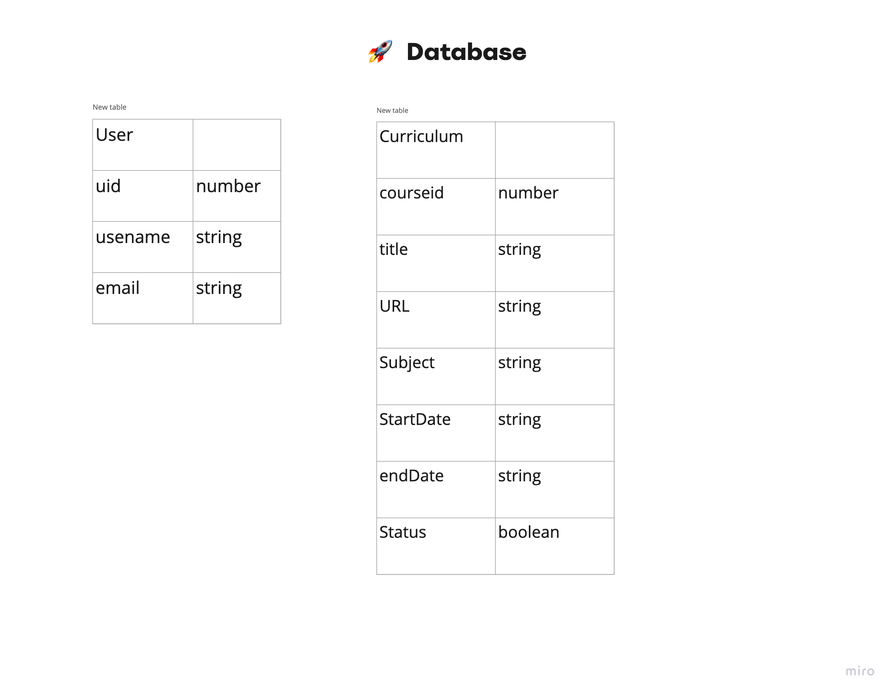

### Title
Gnosis (TEMP)

### Theme
Equity on education

### Description
A study planning responsive website which can...
- introduces online course resources 
- make my curriculum
- share my curriculum
- manage study schedule/status; Snailed it sticker

### Key features
- get keyword info from url
- user account
- my curriculum

### Technology stack
- react
- node.js
- Javascript
- Firebase 8.0

### Known limitations and bugs

### Further action
- calendar view
- filter
- keyword

### Content folder
```
Top level of project folder: 
├── .gitignore               # Git ignore file
├── README.md                # readme file for general information about the project
├── index.html               # landing HTML file
└── w000.html                # loading page representation


Subfolder and files:
├── .git                     # Folder for git repo
├── scripts                  # Folder for scripts
    /account_info.js         # 
    /authentication.js       #
├── data                     # Folder for raw data
    /drinking-fountains.json # information about drinking fountains from City of Vancouver

Firebase hosting files: 
├── .firebase
	/hosting..cache
├── .firebaserc
├── 404.html
├── firebase.json
├── firestore.indexes.json
├── firestore.rules
└── storage.rules
```


